# Repository for Masters Thesis Project

## Table of Contents

- [Introduction](#Introduction) 
- [Objectives](#Objectives) 
- [Methods](#Methods)
  - [CNN for Multi-Label Classification](#cnn-multi-label-classification)
  - [Data Collection](#data-collection)
  - [CNN model building](#CNN-model-building)
  - [Model Training](#model-training)
  - [Model Evaluation](#model-evaluation)
  - [FineTuning Pretrained Models](#FineTuning-Pretrained-Models)
  - [Best Models Results](#Best-Results)
  - [Intepretability techniques](#Intepretability-techniques)

## Introduction

This project will focus on developing and training DL models, specifically CNNs, to predict the species composition of vascular plant assemblages in Norway using satellite-derived climatic data. We will use species occurrence records from the Global Biodiversity Information Facility (GBIF) and associate them with high-resolution climatic variables from sources like CHELSA [(Karger et al., 2021)](https://www.zotero.org/google-docs/?bLQSd8).

## Objectives

#### 1. Develop Deep Learning Models for Species Composition Prediction

- Implement and train CNNs to predict vascular plant assemblage composition in Norway using satellite-derived climate data.
    
- Optimize the model architecture to accurately capture the relationship between climatic variables and species presence across different environmental conditions.
    

#### 2. Enhance Understanding of Climatic Drivers on Plant Assemblages

- Use interpretability techniques to identify and analyze the most influential climatic factors shaping plant assemblages.
    
- Quantify how different climate variables contribute to species composition and assess their ecological significance.
    

#### 3. Predict Species Composition in Undersampled and Future Scenarios

- Utilize the trained models to estimate species compositions in poorly sampled regions of Norway.
    
- Apply future climate projections to forecast changes in vascular plant assemblages under different climate change scenarios.

## Methods
### CNN-Multi-label-Classification

Building a Species Distribution Model (SDM) that interprets climatic maps to predict  vegetation plots compsition can be done by applying [Convolutional Neural Networks (CNN)](https://medium.com/thedeephub/convolutional-neural-networks-a-comprehensive-guide-5cc0b5eae175) to a [multilabel-classification](https://medium.com/data-science-in-your-pocket/multi-label-classification-for-beginners-with-codes-6b098cc76f99). 

Vegetation plots can be encoded as binary vectors where 0 corresponds to absence and 1 corresponds to presence. Thus if we have encoded in a fixed position all the 1819 plant species in norway, we can represent the present and absent species in a determinated area using a binary vector of 1819 variables.

**Species composition vector example:**


As you can see, we have multiple 0 (absent species) and multiple 1 (present species). 
In the same vegetation plot we can have many present species (many 1 values) in the species composition vector.
In a multilabel classification we can have many correct instances (present species) for a single sample. So this kind of classification approach perfectly suits our problem!!

### CNN-SDM model diagram


### Data-Collection
#### Plant assemblage Dataset

I used an [Rscript](https://github.com/rauletepawa/Species_Distribution_Modeling/blob/main/code/1_gbif_norge_data.R) ([Camila Pacheco 2024](https://nsojournals.onlinelibrary.wiley.com/doi/10.1111/ecog.07213)) to download all the GBIF occurrences in vascular plants in Norway main land from 1991 to 2020. I applied some filters to remove all those occurrences located in capitals, institutions, seas or that did not have any valid coordinates assigned inside Norway.

Then I obtained a occurrence clean dataset with a total of 3.011.729 occurences.
Using the [splitting norway in grids](https://github.com/rauletepawa/Species_Distribution_Modeling/blob/main/code/Splitting_Norway_in_grids.ipynb) script we splitted norway in grids of 1km and I counted as a co-occurrence all the species that are observed in the same grid at the same year. Thus I built a plant assemblage dataset that includes all the plant species that co-occur in the same 1km grid the same year excluding all those assemblages that including less than 5 co-occurrences and all those species that appear less than 5 times in Norway between 1991 and 2020.

**Here there is an example of the dataset:**


#### Climatic Dataset
The climatic dataset is composed by a total of **59.074**plant assemblages collected from **1991 until 2018**. For each vegetation plot coordinates (location) I extracted a 10 channels (variables) 32x32 climatic map at 1km resolution (1 pixel corresponds to 1km).
This climatic dataset construction can be followed in the [Build CNN dataset](https://github.com/rauletepawa/Species_Distribution_Modeling/blob/main/code/Build_CNN_dataset.ipynb) script.

We also transformed the plant assamblages into binary presence/absence vectors with the [filtering species script](http://localhost:8888/notebooks/Projects/GitHub/Species_Distribution_Modeling/code/filtering_species.ipynb) 

Here you can see how the final CNN dataset looks like:


#### Climatic Variables

The 11 variables stacked in the climatic maps, acoording to CHELSA's manual, correspond to:

| Shortname | Longname                               | Unit          | Scale | Offset  | Explanation                                                                                                                                                                                    |
| --------- | -------------------------------------- | ------------- | ----- | ------- | ---------------------------------------------------------------------------------------------------------------------------------------------------------------------------------------------- |
| bio1d     | Mean annual air temperature            | °C            | 0.1   | -273.15 | Mean annual daily mean air temperatures averaged over 1 year                                                                                                                                   |
| bio04d    | temperature seasonality                | °C/100        | 0.1   | 0       | standard deviation of the monthly mean temperatures                                                                                                                                            |
| bio12d    | annual precipitation amount            | kg m-2 year-1 | 0.1   | 0       | Accumulated precipitation amount over 1 year                                                                                                                                                   |
| bio15d    | precipitation seasonality              | kg m-2        | 0.1   | 0       | The Coefficient of Variation is the standard deviation of the monthly precipitation estimates expressed as a percentage of the mean of those estimates (i.e. the annual mean)                  |
| gdd5      | Growing degree days heat sum above 5°C | °C            | 0.1   | 0       | heat sum of all days above the 5°C temperature accumulated over 1 year                                                                                                                         |
| scd       | Snow cover days                        | count         | -     | -       | Number of days with snowcover calculated using the snowpack model implementation in from TREELIM (https://doi.org/10.1007/s00035-014-0124-0)                                                   |
| swe       | Snow water equivalent                  | kg m-2 year-1 | 0.1   | 0       | Amount of liquid water if snow is melted                                                                                                                                                       |
| alt       | Altitude                               | m             |       |         | Altitude above the sea level                                                                                                                                                                   |
| cdd       | Consecutive dry days                   | count         | -     | -       | Consecutive dry days is the greatest number of consecutive days per time period with daily from a timeseries of daily precipitation amount                                                     |
| fd        | Frost days                             | count         | -     | -       | Consecutive frost days index is the greatest number of consecutive frost days in a given time period. Frost days is the number of days where minimum of temperature is below 0 degree Celsius. |


### CNN-model-building

#### Loading the training data:

To build the CNN model both [Tensorflow](https://www.tensorflow.org/) and [Pytorch](https://pytorch.org/) have been tested. Resulting Pytorch the best framework to asses this kind of problem as there are more resources online to costumize specific metrics for evaluating the plant assemblage prediction models. 

However, both pipelines in pytorch and tensorflow are uploaded in this repository.

The main file for the model building is the [TFM_CNN_pytorch](https://github.com/rauletepawa/Species_Distribution_Modeling/blob/main/code/TFM_CNN_pytorch.ipynb) file. There I have programmed a reproducible training pipeline where I load the final climatic assemblages dataset in a pytorch data loader with the **MultiLabelDatasetRescale** function. Note that I included the maximum and minimum values of each variable from **1991 to 2018** in order to efficiently apply a MinMax normalization on the climatic maps:

````
class MultiLabelDatasetRescale(Dataset):
    def __init__(self):
        self.x_train, self.x_val, self.x_test, self.y_train, self.y_val, self.y_test = None, None, None, None, None, None
        self.mode = 'train'

        # Stack and convert to float32 tensor
        raw_images = torch.tensor(np.stack(df['climatic_map'].values).astype(np.float32))  # shape: [N, H, W, C]
        self.labels = torch.tensor(np.stack(df['species_vector'].values).astype(np.float32))

        # Transpose to  [C, H, W] for PyTorch
        # raw_images = raw_images.permute(2, 0, 1)
        raw_images = raw_images.permute(0, 3, 1, 2)

        # === NORMALIZE EACH CHANNEL INDEPENDENTLY ===
        # These must match the order of your channels!
        mins = torch.tensor([
            1.9000409841537476,          # gdd5
            1.44621741771698,            # prsd
            0.9102739691734314,          # bio12d
            0.009359435178339481,         # swe
            -9.149993896484375,          # bio01d
            3.1500244140625,             # bio04d
            0.0,                         # cdd
            0.0,                         # fd
            1.0523613691329956,          # bio15d
            0.0,                         # scd
            0.0,                         # altitude
        ])

        maxs = torch.tensor([
            3858.301513671875, # gdd5
            29.09852409362793, # prsd
            21.650711059570312, #bio12d
            113.7122802734375, # swe
            10.45001220703125, #bio01d
            157.55001831054688, #bio04d
            8.0, #cdd
            362.0, # fd
            2.7762691974639893, #bio15d
            365.0, # scd
            2296.0, #altitude
        ])

        # Avoid division by zero (e.g., for crs with constant 0)
        ranges = maxs - mins
        ranges[ranges == 0] = 1  # Prevent division by zero

        # Apply scaling: (x - min) / (max - min)
        # self.images = (raw_images - mins.view(-1, 1, 1)) / ranges.view(-1, 1, 1)
        self.images = (raw_images - mins.view(1, -1, 1, 1)) / ranges.view(1, -1, 1, 1)

    def train_val_test_split(self):
        self.x_train, self.x_test, self.y_train, self.y_test = train_test_split(self.images, self.labels, test_size=0.15, random_state=42)
        self.x_train, self.x_val, self.y_train, self.y_val = train_test_split(self.x_train, self.y_train, test_size=0.15, random_state=42)
        
    def full_train_val_test_split(self):
        self.x_train, self.x_val, self.y_train, self.y_val = train_test_split(self.images, self.labels, test_size=0.15, random_state=42)

    def __len__(self):
        if self.mode == 'train':
            return len(self.x_train)
        elif self.mode == 'val':
            return len(self.x_val)
        elif self.mode == 'test':
            return len(self.x_test)

    def __getitem__(self, idx):
        if self.mode == 'train':
            return {'images': self.x_train[idx], 'labels': self.y_train[idx]}
        elif self.mode == 'val':
            return {'images': self.x_val[idx], 'labels': self.y_val[idx]}
        elif self.mode == 'test':
            return {'images': self.x_test[idx], 'labels': self.y_test[idx]}
````

#### Training Loop Pytorch:

In order to train the models efficiently I coded this training loop function that takes the dataloader,  dataset,  epochs, model type, custom loss and optimizer as variables that we can change and adjust acoordingly. I also implemented a CosineLRScheaduler to optimally decrease the learning rate after 10 epochs to avoid overfitting. In order to find the optimal number of epochs I used an early stopping callback in the function. I also used a weight decay of 5e-2 on the [AdamW](https://pytorch.org/docs/stable/generated/torch.optim.AdamW.html) optimizer as a regularization technique.

```
def training_early_stopping(dataloader, dataset, num_epochs, model, custom_loss, optimizer,delta = 1e-6,patience=5):
    
    # Initialize the learning rate scheduler
    scheduler = CosineLRScheduler(
        optimizer, 
        t_initial=num_epochs,    # Total epochs
        lr_min=1e-4,             # Minimum LR
        warmup_t=10,              # Warm-up epochs
        warmup_lr_init=1e-3      # Initial warm-up LR
    )

    epoch_train_loss = []
    epoch_val_loss = []
    
    best_val_loss = float('inf')
    early_stop_counter = 0
    best_model_state = None

    for epoch in range(num_epochs):
        train_losses = []
        dataset.mode = 'train'
        model.train()

        for D in dataloader:
            optimizer.zero_grad()
            data = D['images'].to(device, dtype=torch.float)
            labels = D['labels'].to(device, dtype=torch.float)
            y_hat = model(data)
            loss = custom_loss(y_hat, labels)
            loss.backward()
            optimizer.step()
            train_losses.append(loss.item())

        epoch_train_loss.append(np.mean(train_losses))

        # Validation
        val_losses = []
        dataset.mode = 'val'
        model.eval()
        with torch.no_grad():
            for D in dataloader:
                data = D['images'].to(device, dtype=torch.float)
                labels = D['labels'].to(device, dtype=torch.float)
                y_hat = model(data)
                loss = custom_loss(y_hat, labels)
                val_losses.append(loss.item())
                
        current_val_loss = np.mean(val_losses)
        epoch_val_loss.append(np.mean(val_losses))

        # **Update Learning Rate Scheduler**
        scheduler.step(epoch + 1)

        # Print progress
        print(f'Train Epoch: {epoch+1} \t Train Loss: {np.mean(train_losses):.6f} \t Val Loss: {np.mean(val_losses):.6f}')
        print(f'Learning Rate: {optimizer.param_groups[0]["lr"]:.8f}')
        
        # Early Stopping Check
        if current_val_loss + delta < best_val_loss:
            best_val_loss = current_val_loss
            best_model_state = model.state_dict()
            early_stop_counter = 0
        else:
            early_stop_counter += 1
            print(f"⚠️ No improvement for {early_stop_counter} epoch(s).")

        if early_stop_counter >= patience:
            print(f"⏹️ Early stopping triggered after {epoch+1} epochs.")
            break

    # Load best model before returning
    if best_model_state is not None:
        model.load_state_dict(best_model_state)
    
    return model, epoch_train_loss, epoch_val_loss
```
#### Establishing a Baseline:

In order to be able to set experiments and try different loss functions and evaluation metrics I architected a simple CNN to establish a baseline and determine if its possible to train a model from scratch on climatic maps to predict species assemblage composition.

```
class CNNModel_1(nn.Module):
    def __init__(self, input_channels,input_size, num_classes):
        super(CNNModel_1, self).__init__()

        # First Convolutional Block
        self.conv1 = nn.Conv2d(input_channels, 64, kernel_size=5, padding=2)  # 'same' padding in TensorFlow = padding=2
        self.bn1 = nn.BatchNorm2d(64)
        self.pool1 = nn.MaxPool2d(kernel_size=2, stride=2)  # MaxPooling2D(pool_size=(2, 2))

        # Second Convolutional Block
        self.conv2 = nn.Conv2d(64, 128, kernel_size=3, padding=1)
        self.bn2 = nn.BatchNorm2d(128)
        self.pool2 = nn.MaxPool2d(kernel_size=2, stride=2)  # MaxPooling2D(pool_size=(2, 2))

        # Third Convolutional Block
        self.conv3 = nn.Conv2d(128, 256, kernel_size=3, padding=1)
        self.bn3 = nn.BatchNorm2d(256)
        self.pool3 = nn.MaxPool2d(kernel_size=2, stride=2)  # MaxPooling2D(pool_size=(2, 2))
        
        # Fourth Convolutional Block
        self.conv4 = nn.Conv2d(256, 512, kernel_size=3, padding=1)
        self.bn4 = nn.BatchNorm2d(512)
        self.pool4 = nn.MaxPool2d(kernel_size=2, stride=2)  # MaxPooling2D(pool_size=(2, 2))

        # Fully Connected Layers
        self.fc1 = nn.Linear(512 * (input_size // 16) * (input_size // 16), 1024)  # Flatten output size depends on input size
        self.dropout1 = nn.Dropout(0.5)

        self.fc2 = nn.Linear(1024, 512)
        self.dropout2 = nn.Dropout(0.3)

        self.fc3 = nn.Linear(512, num_classes)

    def forward(self, x):
        x = self.pool1(F.relu(self.bn1(self.conv1(x))))
        x = self.pool2(F.relu(self.bn2(self.conv2(x))))
        x = self.pool3(F.relu(self.bn3(self.conv3(x))))
        x = self.pool4(F.relu(self.bn4(self.conv4(x))))

        x = torch.flatten(x, start_dim=1)  # Flatten the output for fully connected layers

        x = F.relu(self.fc1(x))
        x = self.dropout1(x)

        x = F.relu(self.fc2(x))
        x = self.dropout2(x)

        x = self.fc3(x)   # x = torch.sigmoid(self.fc3(x))  # Assuming binary classification

        return x
```
#### Loss Functions:

To make the baseline CNN converge in the most efficient way possible I made several experiments with 3 loss metrics:
- [Binary Cross Entropy (BCE)](https://medium.com/data-science/understanding-binary-cross-entropy-log-loss-a-visual-explanation-a3ac6025181a)
- [Focal Loss (FL)](https://arxiv.org/pdf/1708.02002) 
- [Dice Loss](https://cvinvolution.medium.com/dice-loss-in-medical-image-segmentation-d0e476eb486) 

Also BCE and Focal Loss where tested with weighting and without weighting. And I have chose weighting as it has shown better convergence plots such as it is described in [Yuqing Hu 2024](https://besjournals.onlinelibrary.wiley.com/doi/full/10.1111/2041-210X.14466?utm=) where the CustomLoss class is described:

```
import torch.nn.functional as F
import torch.distributed as dist
import argparse

class CustomLoss(nn.Module):
    def __init__(self, loss_fn, args):
        super(CustomLoss, self).__init__()
        self.loss_fn = loss_fn
        self.weighted = args.weighted
        self.args = args
        if self.weighted:
            self.samples_per_cls = list(args.train_label_cnt.values())
            self.no_of_classes = args.num_classes

    def compute_weights(self, labels, beta=0.9999):
        effective_num = 1.0 - np.power(beta, self.samples_per_cls)
        weights = (1.0 - beta) / np.array(effective_num)
        weights = weights / weights.sum() * self.no_of_classes
        labels_one_hot = labels

        weights = torch.tensor(weights).float().to(self.args.device, non_blocking=True)
        weights = weights.unsqueeze(0)
        weights = weights.repeat(labels_one_hot.shape[0],1) * labels_one_hot
        
        return weights
    
    def forward_focal(self, logits, labels,alpha=0.999,gamma=2.0):
        p = torch.sigmoid(logits)
        ce_loss = F.binary_cross_entropy_with_logits(logits, labels, reduction="none")
        p_t = p * labels + (1 - p) * (1 - labels)
        loss = ce_loss * ((1 - p_t) ** gamma)
        
        if self.weighted:
            weights = self.compute_weights(labels)
            weights_t = weights * labels * alpha + (1 - labels) * (1 - alpha)
            weighted_loss = weights_t * loss
            focal_loss = weighted_loss.mean()
        
        else:
            alpha_t = alpha * labels + (1 - alpha) * (1 - labels)
            focal_loss = alpha_t * loss
            focal_loss = focal_loss.mean()
        
        return focal_loss

    
    def forward_bce(self, logits, labels):
        if self.weighted:
            weights = self.compute_weights(labels)
            bce_loss = F.binary_cross_entropy_with_logits(logits, labels, pos_weight = weights)
        else:
            bce_loss = F.binary_cross_entropy_with_logits(logits, labels)
        
        return bce_loss
    
    
    def forward_dice(self, logits, labels):
        p = torch.sigmoid(logits)
        smooth = 1.0
        intersection = (p * labels).sum(0)
        total = (p**2 + labels**2).sum(0)
        dice_loss = 1 - (intersection + smooth)/(total + smooth)
        
        return dice_loss.mean()
    
    
    def forward(self, logits, labels):
        if self.loss_fn == 'bce':
            return self.forward_bce(logits, labels)
        elif self.loss_fn == 'focal':
            return self.forward_focal(logits, labels)
        elif self.loss_fn == 'dice':
            return self.forward_dice(logits, labels)
        
# Example args (you can replace it with your actual arguments)
class Args:
    def __init__(self):
        self.weighted = True  # Set to False if no class weighting is needed
        self.train_label_cnt = class_counts_dict  # Example class counts
        self.num_classes = 1819  # Binary classification
        self.device = torch.device('cuda' if torch.cuda.is_available() else 'cpu')
        self.model_type = 'CNN'
        self.eval = False
        self.thres_method = 'adaptive' # 'global'
        self.threshold = 0.15
```

### Model-Training

The CNN model outputs a logits vector for each training sample, after applying a [sigmoid](https://machinelearningmastery.com/a-gentle-introduction-to-sigmoid-function/) function to these logits vectors, we obtain a probability vector where each probability value is independent of the other probabilities (they do not add up to 1 as in the softmax function), as we treat each species presence probability independent of the other species.

##### BCE loss training

##### FL Training

##### DICE loss Training


##### Loss Functions Conclusions:

The weighted classes loss functions converge to lower loss values than the non weighted ones.
As you can see DICE loss training plot is catastrophic, so I am discarting this loss for any other training.

**Both BCE and FL show good convergence behavior. While BCE exhibits a smoother and more stable loss curve in the later epochs, FL achieves a lower validation error (0.0063 vs. 0.0024). Additionally, FL produces predicted probabilities with a mean around 0.50, which is advantageous for threshold selection. In contrast, BCE tends to output lower probability values (mean ≈ 0.15), indicating reduced confidence in its predictions.**

FL is the best option to train our CNN as it also takes into account class imbalance and makes more focus on those samples that are more difficult to classify (classes where the model tend to  underperform) by downscaling the importance of the most common classes.

As it is shown in [Tsung-Yi Lin, 2018](https://arxiv.org/pdf/1708.02002), the large class imbalance encountered during training of dense detectors **overwhelms** the cross entropy loss. **Easily classified negatives** comprise the majority of the loss and **dominate the gradient**. 
While α balances the importance of positive/negative examples, it does not differentiate between easy/hard examples.

**Balanced Focal Loss formula**

$FL(p_{t}) = −α_{t}(1 − p_{t})^γ log(p_{t})$

### Model-Evaluation

I used a the **evaluate** function to asses general performance scores in the models when evaluating them on the test dataset.
This function computes the True Positives (TP), True Negatives (TN), False Positives (FP) and False Negatives (FN) for all the samples in the test dataset. With these metrics I compute the macro_tss, micro_tss and weighted_tss. 

#### Thresholds

So as we mentioned in the Training Loop section the CNN outputs a logits vector. By applying a sigmoid function, the logits vector is transformed into a probability vector. 
However, we need to transform this probability of presence vector into a binary vector that determines the absolute presence or absence of the plant species. 
Thus we will be able to evaluate the model accuracy and performance by comparing the binary predicted vectors with the true binary vectors. 

So to be able to transform the probabilities vector into a binary vector we have to set a threshold. This threshold will determine based on the probability value if the specie is present (1) or absent (0).

There are 2 ways of setting the threshold:

	1- Setting a global threshold for all the species
	2- Setting a adaptive threshold vector

For this use case where we have many different classes, option 2 is the one that better performs. 
##### Adaptive thresholds

This technique consists in calculating the optimal value of the ROC curve for each class in our species vector. Thus, we obtain a list of the optimal thresholds for each species. We will use this list to optimaly transform the probability vector to a binary vector using a different threshold for each species presence probability that will maximize the  [AUC](https://medium.com/@shaileydash/understanding-the-roc-and-auc-intuitively-31ca96445c02).


#### True Statistic Skill (TSS):

$TSS=Sensitivity+Specificity−1$

This is the fundamental evaluation metric I will use to mesure the performance of the models. The TSS consists in a trade-off between Sensitivity and Specificity.

Where:

- **Sensitivity (Recall or True Positive Rate)** = $\frac{TP}{TP + FN}​$  
    Measures how well the model detects presences.
    
- **Specificity (True Negative Rate)** = $\frac{TN}{TN + FP}$
    Measures how well the model detects absences.
##### Interpretation of TSS

- **TSS = 1** → Perfect model (100% correct classification).
    
- **TSS = 0** → Model performs no better than random chance.
    
- **TSS < 0** → Model performs worse than random.
    

TSS is a performance metric that really suits our Multi-Label classification problem because it accounts for both omission errors (false absences) and commission errors (false presences), making it a good alternative to simpler accuracy metrics, as we are evaluating the model's performance across 1819 different classes.

#### Micro TSS

- Computes TSS globally across all species by summing True Positives (TP), False Positives (FP), True Negatives (TN), and False Negatives (FN) before calculating TSS.
    
- Gives more weight to species with more samples (dominant species).
    

${Micro-TSS} = \frac{\sum TP}{\sum TP + \sum FN} + \frac{\sum TN}{\sum TN + \sum FP} - 1$

When evaluating about overall model performance across all species.


---

####  Macro TSS

- Computes TSS for each species separately and then takes the average across species.
    
- Treats all species equally, regardless of sample size.
    
${Macro-TSS} = \frac{1}{N} \sum_{i=1}^{N} TSS_i$

When species should have equal importance, even if some are rare

---

#### Weighted (Average) TSS

- Averages TSS per species but weights them based on sample size.
    
- Balances between micro and macro by giving species a proportional contribution based on how many samples they have.
    

${Weighted-TSS} = \sum_{i=1}^{N} w_i \cdot TSS_i$

When species importance should be proportional to how frequently they appear in the dataset.

---

##### Which One Should We Use?

- **Micro-TSS** → If we want an overall performance metric (biased toward frequent species).
    
- **Macro-TSS** → If we want equal representation of all species, regardless of rarity.
    
- **Weighted-TSS** → If we want a balance between both approaches.

The choice between these two averaging methods depends on how the problem is approached. Macro TSS treats all species with equal weight, as it calculates the metric independently for each species. It is suitable when all species in the dataset are considered equally important. In contrast, micro TSS places greater emphasis on well-performing species, as it is influenced more by species with high performance. This method is appropriate when focusing on species with superior performance. In this paper, we present both macro and micro TSS to provide a comprehensive assessment of model performance.
##### Evaluate Function:

```
def evaluate(model, eval_loader, criterion,thresholds, args):
    
    TP, TN, FP, FN = 0., 0., 0., 0.
    label_cnt = 0.
    eval_loss = []
    model.eval()
    with torch.no_grad():
        # for data, targets in tqdm(eval_loader, file=sys.stdout):
        for batch in eval_loader:
            if args.model_type=="MLP" or args.model_type=="CNN" or args.model_type=="ViT":
                samples = batch['images'].to(args.device, non_blocking=True)
                outputs = model(samples)
            elif args.model_type=="Fusion":
                samples_img, samples_meta = data
                samples_img = samples_img.to(args.device, non_blocking=True)
                samples_meta = samples_meta.to(args.device, non_blocking=True)
                outputs = model(samples_img, samples_meta)
                
            targets = batch['labels'].to(args.device, non_blocking=True)
            label_cnt += targets.sum(0).float()
            
            loss = criterion(outputs, targets)
            eval_loss.append(loss.item())
            
            if args.thres_method == 'adaptive':
                # thresholds = torch.load(args.output_dir.joinpath('thresholds_train.pth'))
                thresholds = torch.tensor(thresholds, dtype=torch.float32).to("cuda:0")
                # thresholds = torch.tensor(thresholds).to(args.device)
            elif args.thres_method == 'global':
                thresholds = args.threshold
                
            tp, tn, fp, fn = compute_scores(torch.sigmoid(outputs), targets, thresholds)
            TP += tp
            TN += tn
            FP += fp
            FN += fn
        
        eval_loss = torch.tensor(eval_loss).mean().item()
        weight = label_cnt / label_cnt.sum()
        macro_tss, micro_tss, weighted_tss = compute_metrics(TP, TN, FP, FN, weight=weight)
        
        if args.eval:
            recall, spec, tss = compute_metrics_per_cls(TP, TN, FP, FN)
            species = []
            cdref2species = pd.read_csv('filelist/cdref2species.csv')
            for ref in list(map(float, args.classes)):
                temp = cdref2species.loc[cdref2species.cd_ref==ref]
                species.append(temp.nom_reconnu.values[0])
            df = pd.DataFrame({'species':species, 'train_cnt':args.train_label_cnt.values(), 'test_cnt': args.test_label_cnt.values(), 'recall': recall.detach().cpu(), 'specificity': spec.detach().cpu(), 'tss':tss.detach().cpu()})
            df.to_csv(args.output_dir.joinpath('{}_tss_per_cls.csv'.format(args.model_type)), index=False)
            print('Per class performance saved!')
        
        eval_stats = {'eval_loss': eval_loss, 'macro_tss': macro_tss, 'micro_tss': micro_tss, 'weighted_tss': weighted_tss}
        
        return eval_stats
```
### FineTuning-Pretrained-Models:

**Fine-tuning** is a [transfer learning](https://medium.com/@davidfagb/guide-to-transfer-learning-in-deep-learning-1f685db1fc94) technique where you take a **pretrained neural network** (like [ResNet18](https://arxiv.org/pdf/1512.03385), trained on ImageNet) and adapt it to a **new, specific task**, often with a **smaller dataset**.

Instead of training the whole model from scratch, we reuse the pretrained model’s **learned features** (like edges, textures, shapes), which are already very good at general visual understanding.

Resnet18 architecture:


Fine-tuning this architecture will allow us to achieve better results with fewer epochs than self-architected models training from scratch.
#### ResNet18 FineTuning:

As pretrained models are adapted to 3 channel data by default we modifyied the first layer of the model to accept 11 channels image data. We loaded the weights from the Imagenet 1000 V1 Resnet18. 

```
class CustomResNet18(nn.Module):
    def __init__(self, num_classes):
        super(CustomResNet18, self).__init__()
        
        # Load Pretrained ResNet18
        # self.resnet = models.resnet18(weights=models.ResNet18_Weights.IMAGENET1K_V1)
        self.resnet = models.resnet18(weights=True)

        # Modify the first convolutional layer to accept 11 channels instead of 3
        self.resnet.conv1 = nn.Conv2d(11, 64, kernel_size=7, stride=2, padding=3, bias=False)

        # Modify the final fully connected layer to match the number of classes
        self.in_features = self.resnet.fc.in_features
        self.resnet.fc = nn.Linear(self.in_features, num_classes)

        # Unfreezing all layers to train the whole model
        for param in self.resnet.parameters():
            param.requires_grad = True

    def forward(self, x):
        return self.resnet(x)

```


We tested different fine-tuning strategies: 

1. Fine-tuning only the forward block
2. Fine-tuning the forward layer + the last convolutional block
3. Fine-tuning all the layers
4. Fine-tuning the forward block for 3 epochs and then unfreeze al the layers for deeper fine-tuning.

The 3rd strategy is the one that has given better and more consistant results converging at epoch 7.

We employed a cosine scheduler with a 5-epoch warm-up, starting at 1e-4, and set the maximum learning rate to 1e-3, with a minimum learning rate of 1e-6. Regarding regularization, which plays an essential role during training that prevents the model from overfitting, we used a weight decay of 5e-2 on the AdamW optimizer.

AdamW is an improved version of the well-known Adam optimizer that also tracks averages of the gradient (called the first moment) and the square of the gradients (called the second moment). But instead of adding the regularization term to the cost function, AdamW directly computes its corresponding gradient form and adds it to perform gradient descend. This avoids the regularization term from going through the moving average computation, and effectively improves the efficacy of regularization.

**Fine-Tuning Loss Plot:**


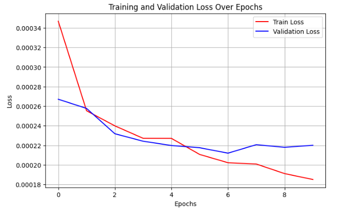
**Fine-tuning function:**
```
def fine_tunning(dataloader, dataset, num_epochs, model, custom_loss, optimizer,delta,patience):
    
    # Initialize the learning rate scheduler
    scheduler = CosineLRScheduler(
        optimizer, 
        t_initial=num_epochs,    # Total epochs
        lr_min=1e-5, #1e-5            # Minimum LR
        warmup_t=2,  #2            # Warm-up epochs
        warmup_lr_init=1e-4 #1e-4     # Initial warm-up LR
    )

    epoch_train_loss = []
    epoch_val_loss = []
    
    best_val_loss = float('inf')
    early_stop_counter = 0
    best_model_state = None

    for epoch in range(num_epochs):
        train_losses = []
        dataset.mode = 'train'
        model.train()

        for D in dataloader:
            optimizer.zero_grad()
            data = D['images'].to(device, dtype=torch.float)
            labels = D['labels'].to(device, dtype=torch.float)
            y_hat = model(data)
            loss = custom_loss(y_hat, labels)
            loss.backward()
            optimizer.step()
            train_losses.append(loss.item())

        epoch_train_loss.append(np.mean(train_losses))

        # Validation
        val_losses = []
        dataset.mode = 'val'
        model.eval()
        with torch.no_grad():
            for D in dataloader:
                data = D['images'].to(device, dtype=torch.float)
                labels = D['labels'].to(device, dtype=torch.float)
                y_hat = model(data)
                loss = custom_loss(y_hat, labels)
                val_losses.append(loss.item())
                
        current_val_loss = np.mean(val_losses)
        epoch_val_loss.append(np.mean(val_losses))

        # **Update Learning Rate Scheduler**
        scheduler.step(epoch + 1)

        # Print progress
        print(f'Train Epoch: {epoch+1} \t Train Loss: {np.mean(train_losses):.6f} \t Val Loss: {np.mean(val_losses):.6f}')
        print(f'Learning Rate: {optimizer.param_groups[0]["lr"]:.8f}')
        
        # Early Stopping Check
        if current_val_loss + delta < best_val_loss:
            best_val_loss = current_val_loss
            best_model_state = model.state_dict()
            early_stop_counter = 0
        else:
            early_stop_counter += 1
            print(f"⚠️ No improvement for {early_stop_counter} epoch(s).")

        if early_stop_counter >= patience:
            print(f"⏹️ Early stopping triggered after {epoch+1} epochs.")
            break

    # Load best model before returning
    if best_model_state is not None:
        model.load_state_dict(best_model_state)
    
    return model, epoch_train_loss, epoch_val_loss
```

#### ViT Fine-tuning

We fine-tune a pretrained [DeiT3 Vision Transformer (ViT)](https://arxiv.org/abs/2204.07118) to predict plant species assemblages from multi-channel climate raster data. Our custom architecture adapts the ViT to work with climate maps and perform multi-label classification:

- **Input preprocessing**: An initial convolutional stem reduces 11-channel climate inputs (e.g. temperature, precipitation) to 3 channels to match ViT’s expected input format. Images were resized from 32x32 to 224x244 pixels.
    
- **ViT Backbone**: A pretrained `deit3_base_patch16_224` model is loaded via the `timm` library, enabling transfer learning.
    
- **Classifier head**: The default classification head is replaced with a fully connected layer outputting one logit per species, supporting multi-label prediction across 1819 plant species.
    

The model is fine-tuned using:

- **Optimizer**: AdamW with learning rate `1e-4` and weight decay `5e-2`.
    
- **Loss**: A custom Focal Loss designed to handle class imbalance.
    
- **Training loop**: Includes early stopping and performance tracking across epochs.
    

This approach enables predictive modeling of species distributions based on high-dimensional climate data, with applications in ecology and climate change impact studies.


### Best-Results

The state of the art models tested on the alps region have demonstrated that it is possible to fine tune CNN models with a macro and micro TSS of 69.67% and 75.24% respectively.

Best models performance summary table:

**Adaptive Threshold**

| Model                  | Eval Loss | Macro TSS | Micro TSS | Weighted TSS |
| ---------------------- | --------- | --------- | --------- | ------------ |
| Fine Tuned ResNet18 FL | 0.00022   | 0.517     | 0.518     | 0.390        |
| Baseline CNN FL        | 0.00022   | 0.507     | 0.511     | 0.381        |
| Baseline CNN BCE       | 0.00456   | 0.535     | 0.540     | 0.408        |
| Fine Tuned ViT         | 0.00025   | 0.419     | 0.430     | 0.303        |

**Global Threshold**

| Model                  | Eval Loss | Macro TSS | Micro TSS | Weighted TSS |
| ---------------------- | --------- | --------- | --------- | ------------ |
| Fine Tuned ResNet18 FL | 0.00022   | 0.555     | 0.573     | 0.381        |
| Baseline CNN FL        | 0.00022   | 0.548     | 0.513     | 0.361        |
| Baseline CNN BCE       | 0.00456   | 0.193     | 0.021     | 0.026        |
| Fine Tuned ViT         | 0.00025   | 0.419     | 0.430     | 0.303        |
### Training-1991-2017-and-testing-with-2018-data

Due to spatial overlap between some samples, a random train-test split does not guarantee that the model is fully isolated from test-time climatic information during training. To address this, we adopt a **temporal split** strategy: samples from **1991 to 2017** are used for training, while **2018** samples are reserved exclusively for testing and evaluation.

Using 2018 as a dedicated test set also facilitates **model interpretability during experimentation**, enabling us to **benchmark performance against recent data** and analyze where the model performs well or poorly under realistic and unseen climatic scenarios.

We use a Fine-Tuned ResNet18 on **1991-2017** data to make the following experiments and model interpretation as it is the training strategy that gave the best results in the previous experiments:

| Model                  | Eval Loss | Macro TSS | Micro TSS | Weighted TSS |
| ---------------------- | --------- | --------- | --------- | ------------ |
| Fine Tuned ResNet18 FL | 0.00027   | 0.380     | 0.557     | 0.302        |
### Intepretability-techniques

Now we arrived where the fun part begins. Let's do some ecology!! All the analysis can be found and followed in the [resampling_data](https://github.com/rauletepawa/Species_Distribution_Modeling/blob/main/code/Resampling_data_2018.ipynb) jupyter notebook

In order to undertsand the model I conducted several tests and interpretation techniques:
1. Predicting the species richness 
2. Clusterizing and plotting the flattened vectors 
3. Integrated gradients interpretation
4. Single species distribution modeling

#### Preparing Dataset for the experiments

To evaluate our model using realistic simulations across the entire Norwegian territory, I divided Norway into approximately 330.000 grids of 1 km² each. From these, I performed a downsampling by selecting **11.400** randomly distributed grid points every 0.08º (~8 km), which provides sufficient coverage of Norway’s diverse climatic zones and geographic regions. The accompanying map illustrates the spatial coverage of the downsampled grids used for model interpretation.


Then I extracted the 32x32x10 climatic maps in the year 2018 for each grid and I builded the dataset with the climatic information:

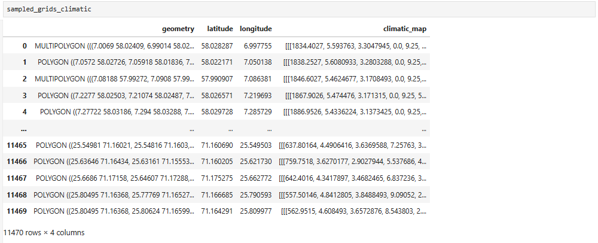
Then I loaded the fine-tuned ResNet18 (trained with **1991-2017** data) model and predicted the species composition binary vector for each location.

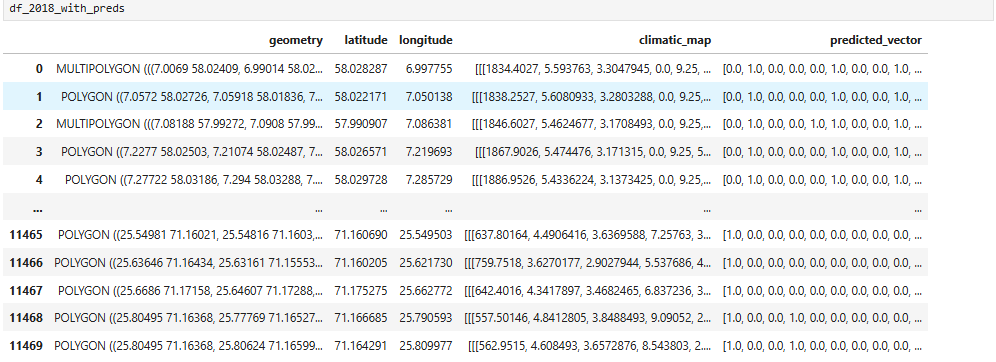

Now we can dive into all kinds of analyses 🎯
We’ve already modeled the plant community composition for ALL of Norway! 🇳🇴🌿 
This opens up endless possibilities for ecological interpretation and climate impact studies 🔬📊

#### Predicting the Species Richness

We can easily make a species richness heatmap for all Norway calculating the species richness for each location with this funciton.

```
def calculate_sp_richness(species_vectors):
    richness = []
    for i in species_vectors:
        nonzero = np.count_nonzero(i)
        richness.append(nonzero)
    return richness    
df_2018_with_preds['predicted_richness'] = calculate_sp_richness(df_2018_with_preds['predicted_vector'])    
df_2018_with_preds
```

Note that the species richness here is defined as the total number of unique species in a sample.

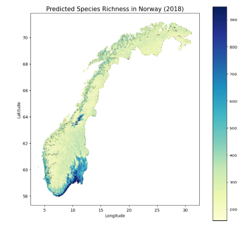
In the species richness map, we observe that the highest diversity is concentrated around the Oslo region. This pattern aligns with expert knowledge and previous studies (_cite source here_). However, it’s important to note that these areas also correspond to some of the most densely populated counties in Norway, which are consequently the most heavily sampled in the GBIF dataset. This introduces a potential sampling bias that may be influencing the observed patterns. A similar situation occurs in the Trøndelag region, where a notable diversity hotspot appears around Trondheim. Despite these biases, the model generally predicts higher species richness along the Norwegian coast, with a clear gradient showing greater richness in the southern regions compared to the north; a trend consistent with known ecological and climatic patterns (_cite source here_).

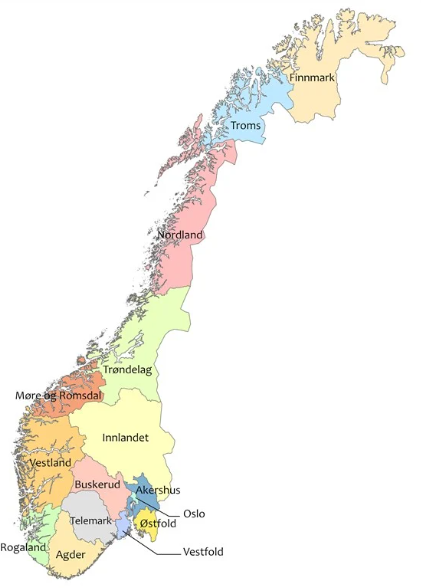


#### UMAP

While our proposed models were able to accurately predict multiple species altogether, understanding the underlying patterns behind these predictions is crucial. This is feasible due to the network's capability to learn generalized features during training, aligning with the principles of Transfer Learning (Pan & Yang, [2009](https://besjournals.onlinelibrary.wiley.com/doi/full/10.1111/2041-210X.14466?utm=#mee314466-bib-0094); Torrey & Shavlik, [2010](https://besjournals.onlinelibrary.wiley.com/doi/full/10.1111/2041-210X.14466?utm=#mee314466-bib-0128)). Additionally, the feature extractor reduces the input dimensionality significantly, streamlining the process while retaining essential input information. To demonstrate this, we computed the image embeddings for the  **11.400** samples using CNN's feature extractor, generating a total of _N_ points, each represented as a **2048-dimensional** feature vector. We then project these high-dimensional feature vectors into a three-dimensional space for visualization purposes using Uniform Manifold Approximation and Projection (UMAP) (McInnes et al., [2018](https://besjournals.onlinelibrary.wiley.com/doi/full/10.1111/2041-210X.14466?utm=#mee314466-bib-0086)).

The 3-D projection unveiled distinct clusters of community plots, each group sharing common image-derived features. This concept may resonate with those experienced in ecological ordinations, somewhat akin to community plot ordinations mapped onto a 3-D space through environmental principal component analysis (PCA). However, the distinguishing factor here is that the primary components emerging from UMAP reflect highly intricate features learned directly from the images, providing a unique perspective on community patterns.


#### 🌍 Interactive 3D UMAP Plot


[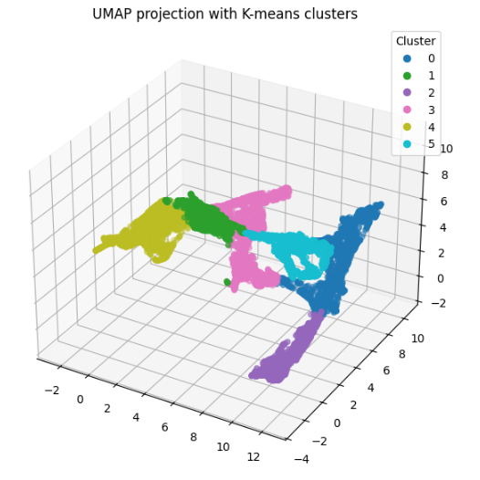](https://rauletepawa.github.io/Species_Distribution_Modeling/umap_3d_plot_no_rotate.html)

🔗 Click the image to open the interactive version


#### Plotting U-MAP in Norway

To further interpret these patterns, we spatially mapped the 11,400 samples colored by their UMAP-derived cluster assignments. The resulting visualization revealed 6 clear geographic structuring, where distinct clusters corresponded to specific climatic and ecological regions. These spatial patterns suggest that the CNN successfully learned latent features that capture underlying vegetation–climate associations, potentially delineating ecological zones or floristic regions across the study area.

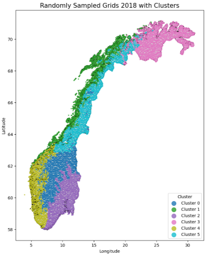
The map reveals that the clusters exhibit well-defined boundaries and minimal overlap, indicating that the identified climatic regions are both relevant and clearly differentiated.

The clusters highlight strong climatic differences between the west coast and the rest of the country. This pattern aligns with the west–east Atlantic gradient, which significantly influences both climate conditions and plant community composition.
We also observe strong climatic gradients between the southern and northern regions of Norway, with three main climatic ecoregions identified in the south: the southwestern coastal zone, the central alpine area, and the southeastern region. Notably, the southeastern region shows the highest species richness, as indicated in the previous species richness figure.

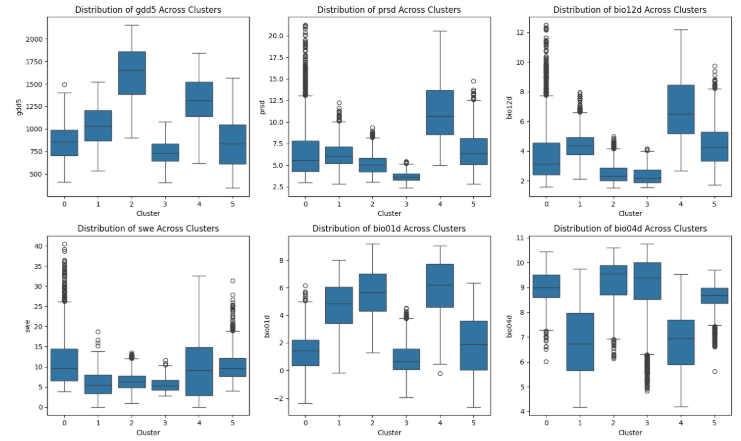
This figure provides a more detailed view of the distribution of climatic variables within each cluster, offering an overview of the characteristic climatic profiles associated with each region.

#### Integrated gradients Interpretation

To interpret the predictions of the convolutional neural network (CNN) and identify the most influential climatic features associated with the presence of _Salix reticulata_, I employed the [Integrated Gradients](https://captum.ai/docs/attribution_algorithms#integrated-gradients) (IG) method implemented in the [Captum](https://captum.ai/) library. 
Integrated Gradients is a widely used attribution technique that quantifies feature importance by integrating the gradients of the model's output with respect to the input along a linear path from a baseline (e.g., a zero-valued image) to the actual input. This approach mitigates issues such as gradient saturation and provides more stable and interpretable attributions compared to raw gradients. I applied IG to all climatic input samples in which _Salix reticulata_ was present, and computed the average attribution maps across these samples. This enabled us to identify the spatial and climatic patterns most strongly associated with the model's prediction of the species’ presence, offering ecological insights into the climatic preferences of _S. reticulata_ as captured by the model.

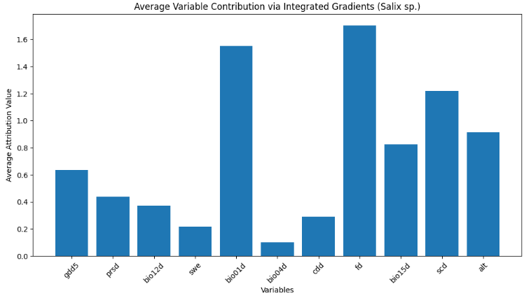
We can see that for _Salix reticulata_ the most important variables are the frost days (fd), the mean annual air temperature (bio01d) and the snow cover days (scd) as it is a specie that lives on alpine exposed areas with low snow accumulation.

[Integrated Gradients Tutorial](https://captum.ai/tutorials/Titanic_Basic_Interpret) 

#### Single species distribution modeling

Finally, we visualized the distribution of individual species across Norway. As an illustrative example, these figures present the distribution of _Salix reticulata_ and _Salix herbacea_. The left panel displays the reference distribution of _S. herbacea_ based on data from Artsdatabanken (that we will use as the reference most updated distribution), the center panel shows the model’s predicted distribution for the year 2018 using the CNN, and the right panel indicates the GBIF-based occurrence data from **1991 to 2017** used during training. 

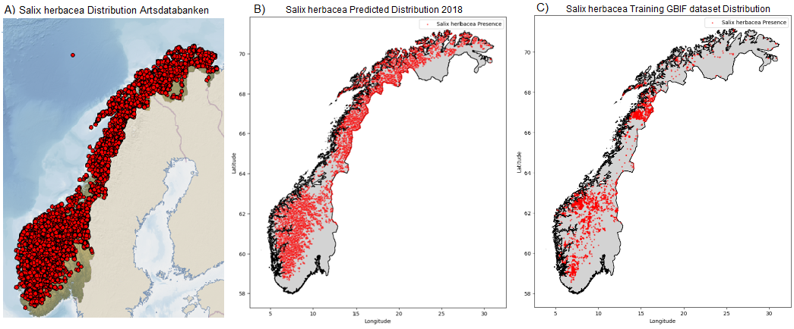

The model effectively captures the climatic patterns associated with the presence of _S. herbacea_ and generalizes these patterns to predict its potential distribution across the entire country. 

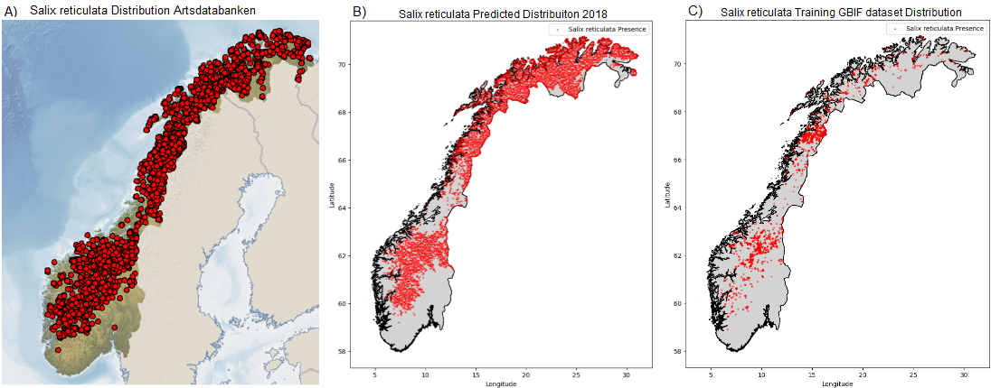

Remarkably, this predictive capacity is achieved despite the sparse and uneven distribution of the training data (as seen in the GBIF occurrences), yet the model is able to effectively learn meaningful patterns and generalize from this limited data, demonstrating its ability to extrapolate robustly from relatively few samples.
Moreover, this modeling approach is scalable and can be applied simultaneously to over 1,800 species, enabling comprehensive biodiversity assessments under current and future climate scenarios.